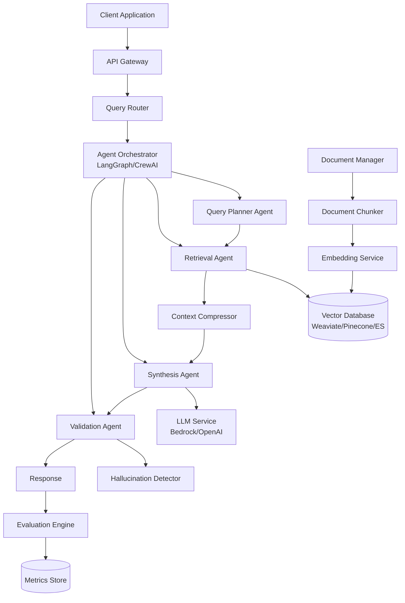
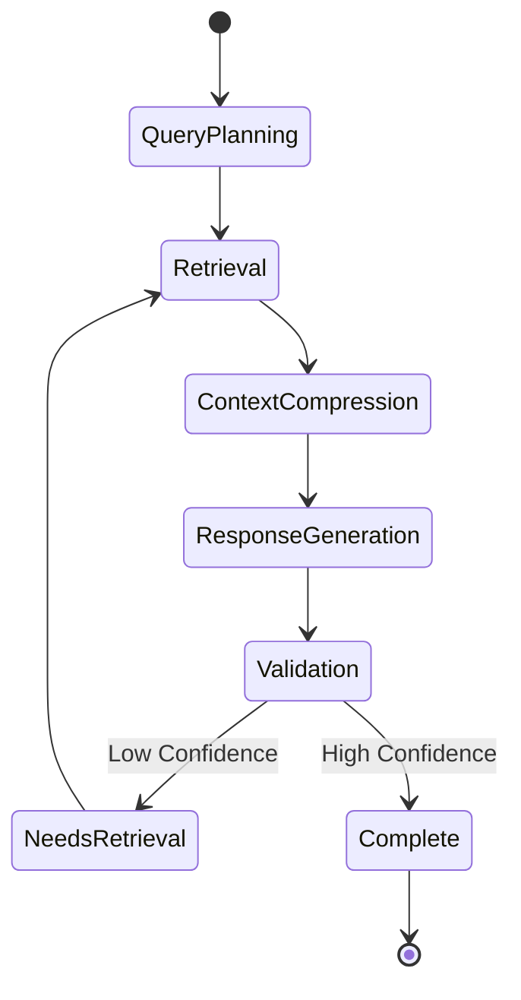
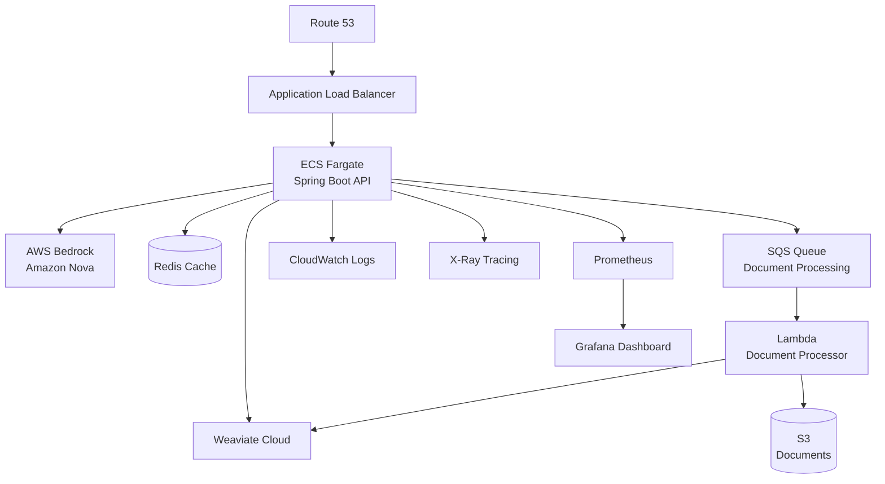

# Design Document: Intelligent Customer Support Knowledge Assistant

## Overview

The Intelligent Customer Support Knowledge Assistant is a production-ready, real-time AI system built on a microservices architecture. It combines vector databases, advanced RAG patterns, multi-agent orchestration, and comprehensive evaluation to deliver accurate, hallucination-free support responses.

The system uses a pipeline architecture where queries flow through multiple stages: ingestion, planning, retrieval, compression, generation, validation, and evaluation. Each stage is independently scalable and monitored.

## Architecture

### High-Level Architecture



### Technology Stack

**Core Framework:**
- Java 21 with Spring Boot 3.2+ for API layer
- Spring AI for LLM and RAG orchestration
- Spring WebFlux for reactive/async processing
- Jakarta Validation for data validation

**Vector Databases (pluggable):**
- Weaviate (primary recommendation - open source, feature-rich, has Java client)
- Pinecone (managed alternative, Java SDK available)
- Elasticsearch with vector search (native Spring Data support)

**LLM Providers:**
- AWS Bedrock with Amazon Nova (primary) - via AWS SDK for Java
- OpenAI GPT-4 (fallback) - via Spring AI OpenAI integration
- Anthropic Claude via Bedrock (optional)

**Agent Orchestration:**
- Spring AI with custom StateMachine for workflow orchestration
- Spring State Machine for complex agent workflows
- Custom agent framework using Spring's dependency injection
- CompletableFuture for async agent coordination

**Evaluation & Monitoring:**
- Custom evaluation framework with Spring Batch
- Micrometer for metrics collection
- Prometheus + Grafana for metrics visualization
- AWS CloudWatch for logs
- Spring Boot Actuator for health checks

## Components and Interfaces

### 1. API Gateway

**Responsibility:** Entry point for all client requests, handles authentication, rate limiting, and request routing.

**Interface:**
```java
public record QueryRequest(
    @NotBlank String query,
    String sessionId,
    Map<String, Object> context,
    boolean stream
) {}
    
public record QueryResponse(
    String response,
    List<Source> sources,
    double confidenceScore,
    ResponseMetadata metadata
) {}
```

**Endpoints:**
- `POST /api/v1/query` - Submit a query
- `POST /api/v1/query/stream` - Submit query with streaming response
- `GET /api/v1/health` - Health check
- `POST /api/v1/documents` - Upload documents
- `GET /api/v1/metrics` - Retrieve evaluation metrics

### 2. Query Planner Agent

**Responsibility:** Decomposes complex queries into sub-queries and determines execution order.

**Algorithm:**
1. Analyze query using LLM to identify multiple questions
2. Extract dependencies between sub-queries
3. Create a directed acyclic graph (DAG) of query execution
4. Return ordered list of sub-queries

**Interface:**
```java
public record QueryPlan(
    String originalQuery,
    List<SubQuery> subQueries,
    List<Integer> executionOrder
) {}
    
public record SubQuery(
    int id,
    String query,
    List<Integer> dependencies,
    QueryType queryType  // factual, comparison, procedural, etc.
) {}

public enum QueryType {
    FACTUAL, COMPARISON, PROCEDURAL, ANALYTICAL
}
```

**Implementation Pattern:**
- Use LLM with structured output (function calling) to decompose queries
- Implement topological sort for dependency resolution
- Cache common query patterns

### 3. Retrieval Agent with Hybrid Search

**Responsibility:** Retrieves relevant documents using hybrid search (vector + keyword).

**Hybrid Search Strategy:**
1. **Vector Search:** Embed query and find top-k similar documents (k=20)
2. **Keyword Search:** BM25 or Elasticsearch full-text search (top-k=20)
3. **Fusion:** Reciprocal Rank Fusion (RRF) to combine results
4. **Reranking:** Use cross-encoder model to rerank top 10 results

**Interface:**
```java
public record RetrievalRequest(
    String query,
    int topK,
    Map<String, Object> filters,
    SearchType searchType
) {
    public RetrievalRequest {
        if (topK == 0) topK = 10;
        if (searchType == null) searchType = SearchType.HYBRID;
    }
}
    
public record RetrievalResult(
    List<Document> documents,
    List<Double> scores,
    RetrievalMetadata retrievalMetadata
) {}

public enum SearchType {
    VECTOR, KEYWORD, HYBRID
}
```

**Multi-hop RAG Implementation:**
- First retrieval: Get initial context
- Extract entities/concepts from retrieved docs
- Second retrieval: Query for related information using extracted entities
- Combine results with deduplication

### 4. Context Compressor

**Responsibility:** Reduces retrieved context to only relevant information.

**Compression Techniques:**
1. **Extractive:** Use LLM to extract relevant sentences
2. **Reranking:** Score each sentence by relevance to query
3. **Redundancy Removal:** Remove duplicate information
4. **Token Budget:** Ensure final context fits within token limit

**Interface:**
```java
public record CompressionRequest(
    List<Document> documents,
    String query,
    int maxTokens
) {
    public CompressionRequest {
        if (maxTokens == 0) maxTokens = 4000;
    }
}
    
public record CompressionResult(
    String compressedContext,
    double compressionRatio,
    List<String> retainedDocuments  // document IDs
) {}
```

**Implementation:**
- Use LongLLMLingua or similar for compression
- Fallback to simple sentence scoring if compression service unavailable

### 5. Agent Orchestrator (LangGraph)

**Responsibility:** Coordinates all agents in a stateful workflow.

**State Graph:**
```java
@Data
@Builder
public class AgentState {
    private String query;
    private QueryPlan queryPlan;
    private List<Document> retrievedDocs;
    private String compressedContext;
    private String generatedResponse;
    private ValidationResult validationResult;
    private Map<String, Object> metadata;
    private WorkflowStatus status;
}

public enum WorkflowStatus {
    PLANNING, RETRIEVING, COMPRESSING, GENERATING, VALIDATING, COMPLETE, FAILED
}
```

**Workflow:**


**Implementation:**
- Use LangGraph's StateGraph for workflow definition
- Implement conditional edges for retry logic
- Add checkpointing for long-running queries

### 6. Synthesis Agent with LLM Integration

**Responsibility:** Generates responses using retrieved context and LLM.

**LLM Configuration:**
- **Primary:** AWS Bedrock with Amazon Nova Pro
- **Fallback:** OpenAI GPT-4 Turbo
- **Temperature:** 0.1 (low for factual responses)
- **Max Tokens:** 1000

**Prompt Template:**
```java
public static final String SYNTHESIS_PROMPT = """
    You are a customer support assistant. Answer the question based ONLY on the provided context.
    
    Context:
    {context}
    
    Question: {query}
    
    Instructions:
    1. Answer directly and concisely
    2. Cite sources using [Source: document_name]
    3. If the context doesn't contain the answer, say "I don't have enough information"
    4. Do not make up information
    
    Answer:""";
```

**Interface:**
```java
public record SynthesisRequest(
    String query,
    String context,
    List<Document> sources
) {}
    
public record SynthesisResult(
    String response,
    List<Citation> citations,
    int tokensUsed,
    String modelUsed
) {}
```

### 7. Hallucination Detector

**Responsibility:** Validates generated responses against source documents.

**Detection Methods:**
1. **Entailment Check:** Use NLI model to verify each claim
2. **Fact Extraction:** Extract facts from response and verify in sources
3. **Semantic Similarity:** Compare response embeddings to source embeddings
4. **LLM-as-Judge:** Use LLM to evaluate faithfulness

**Scoring:**
```java
double confidenceScore = 
    0.4 * entailmentScore +
    0.3 * factVerificationScore +
    0.2 * semanticSimilarity +
    0.1 * llmJudgeScore;
```

**Interface:**
```java
public record ValidationRequest(
    String response,
    List<Document> sources,
    String query
) {}
    
public record ValidationResult(
    boolean isValid,
    double confidenceScore,
    List<String> hallucinatedClaims,
    Map<String, Object> verificationDetails
) {}
```

### 8. Document Manager

**Responsibility:** Handles document ingestion, chunking, and embedding.

**Chunking Strategy:**
- **Method:** Recursive character splitting with overlap
- **Chunk Size:** 500-1000 tokens
- **Overlap:** 100 tokens
- **Respect Boundaries:** Preserve paragraphs and sentences

**Metadata Enrichment:**
- Extract title, headers, dates
- Generate summary for each chunk
- Add document type, source, version

**Interface:**
```java
public record DocumentUpload(
    String content,
    String filename,
    String documentType,
    Map<String, Object> metadata
) {}
    
public record ChunkingResult(
    List<DocumentChunk> chunks,
    List<float[]> embeddings,
    List<Map<String, Object>> chunkMetadata
) {}
```

### 9. Evaluation Engine

**Responsibility:** Measures RAG performance using standard metrics.

**Metrics Tracked:**
1. **Retrieval Metrics:**
   - Precision@k
   - Recall@k
   - MRR (Mean Reciprocal Rank)
   - NDCG (Normalized Discounted Cumulative Gain)

2. **Generation Metrics:**
   - Answer Relevancy (semantic similarity to query)
   - Faithfulness (alignment with sources)
   - Context Precision (relevance of retrieved docs)
   - Context Recall (coverage of ground truth)

3. **System Metrics:**
   - Latency (p50, p95, p99)
   - Token usage per query
   - Cost per query
   - Error rate

**Implementation:**
- Use RAGAS library for RAG-specific metrics
- Implement custom metrics for hallucination detection
- Store metrics in time-series database (Prometheus)

**Interface:**
```java
public record EvaluationRequest(
    String query,
    String response,
    List<Document> retrievedDocs,
    String groundTruth  // for offline evaluation, nullable
) {}
    
public record EvaluationResult(
    Map<String, Double> metrics,
    Instant timestamp,
    String queryId
) {}
```

## Data Models

### Document Model
```java
@Entity
@Data
@Builder
public class Document {
    @Id
    private String id;
    
    @Column(columnDefinition = "TEXT")
    private String content;
    
    @Embedded
    private DocumentMetadata metadata;
    
    @Column(columnDefinition = "vector")
    private float[] embedding;
    
    private Integer chunkIndex;
}
    
@Embeddable
@Data
public class DocumentMetadata {
    private String title;
    private String source;
    private String author;
    private Instant createdAt;
    private Instant updatedAt;
    private String documentType;
    private String version;
    
    @ElementCollection
    private List<String> tags;
}
```

### Query Session Model
```java
@Entity
@Data
@Builder
public class QuerySession {
    @Id
    private String sessionId;
    
    @OneToMany(cascade = CascadeType.ALL)
    private List<Query> queries;
    
    private Instant createdAt;
    private String userId;
}
    
@Entity
@Data
@Builder
public class Query {
    @Id
    private String queryId;
    
    private String queryText;
    
    @Column(columnDefinition = "TEXT")
    private String response;
    
    @ElementCollection
    private List<String> sources;
    
    private double confidenceScore;
    private int latencyMs;
    private Instant timestamp;
}
```

### Vector Store Schema

**Weaviate Schema:**
```python
{
    "class": "SupportDocument",
    "properties": [
        {"name": "content", "dataType": ["text"]},
        {"name": "title", "dataType": ["string"]},
        {"name": "source", "dataType": ["string"]},
        {"name": "document_type", "dataType": ["string"]},
        {"name": "created_at", "dataType": ["date"]},
        {"name": "chunk_index", "dataType": ["int"]},
        {"name": "metadata", "dataType": ["object"]}
    ],
    "vectorizer": "none",  # we provide embeddings
    "moduleConfig": {
        "generative-openai": {}
    }
}
```

## Error Handling

### Error Categories

1. **Retrieval Errors:**
   - Vector DB unavailable → Use cached results or fallback DB
   - No relevant documents found → Return "insufficient information" response
   - Timeout → Reduce top_k and retry

2. **LLM Errors:**
   - Rate limit → Queue request and retry with exponential backoff
   - Model unavailable → Switch to fallback model
   - Context too long → Increase compression ratio

3. **Validation Errors:**
   - Low confidence score → Flag for human review
   - Hallucination detected → Regenerate with stricter prompt
   - Validation service down → Skip validation with warning

### Retry Strategy
```java
@Retryable(
    maxAttempts = 3,
    backoff = @Backoff(
        delay = 2000,
        multiplier = 2,
        maxDelay = 10000
    ),
    retryFor = {TimeoutException.class, ConnectionException.class}
)
public CompletableFuture<Response> callWithRetry(Supplier<Response> operation) {
    return CompletableFuture.supplyAsync(operation);
}
```

### Circuit Breaker
- Implement circuit breaker for external services
- Open circuit after 5 consecutive failures
- Half-open after 30 seconds
- Close after 2 successful requests

## Testing Strategy

### Unit Tests
- Test each agent independently with mocked dependencies
- Test chunking logic with various document types
- Test compression algorithms with different context sizes
- Test hallucination detection with known hallucinated responses

### Integration Tests
- Test full RAG pipeline end-to-end
- Test multi-hop retrieval with complex queries
- Test agent orchestration with LangGraph
- Test fallback mechanisms (LLM, vector DB)

### Evaluation Tests
- Create test dataset with ground truth answers
- Measure baseline metrics before optimization
- Run A/B tests for different retrieval strategies
- Compare hybrid search vs pure vector search

### Load Tests
- Simulate 100 concurrent users
- Test streaming response performance
- Measure p95 latency under load
- Test auto-scaling behavior

### Test Data
- Create synthetic support queries (100+)
- Collect real anonymized support tickets
- Build ground truth dataset with expert answers
- Include edge cases (ambiguous queries, multi-hop questions)

## Deployment Architecture

### AWS Infrastructure



### Container Strategy
- **API Service:** Spring Boot 3.2+ app in Docker container on ECS Fargate
- **Worker Service:** Spring Batch jobs for async document processing
- **Scaling:** Auto-scale based on CPU and request queue depth
- **Build:** Multi-stage Docker build with GraalVM native image (optional for faster startup)

### Configuration Management
- Use AWS Systems Manager Parameter Store for secrets
- Environment-specific configs (dev, staging, prod)
- Feature flags for A/B testing

## Performance Optimization

### Caching Strategy
1. **Query Cache:** Cache responses for identical queries (Redis, TTL: 1 hour)
2. **Embedding Cache:** Cache embeddings for common queries
3. **Document Cache:** Cache frequently accessed documents

### Batch Processing
- Batch embedding generation for multiple documents
- Batch retrieval for sub-queries when possible

### Async Processing
- Use async/await for all I/O operations
- Parallel retrieval for multi-hop RAG
- Stream responses to reduce perceived latency

## Security Considerations

1. **Authentication:** JWT tokens for API access
2. **Authorization:** Role-based access control for documents
3. **Data Privacy:** PII detection and masking in logs
4. **Rate Limiting:** Per-user and per-IP rate limits
5. **Input Validation:** Sanitize all user inputs
6. **Secrets Management:** AWS Secrets Manager for API keys

## Monitoring and Observability

### Dashboards
1. **System Health:** API latency, error rates, throughput
2. **RAG Performance:** Retrieval quality, generation quality, hallucination rate
3. **Cost Tracking:** Token usage, API costs per query
4. **User Analytics:** Query patterns, session duration

### Alerts
- P0: API down, critical error rate > 5%
- P1: Latency p95 > 5s, hallucination rate > 10%
- P2: Cost spike, cache hit rate < 50%

### Logging
- Structured JSON logs with correlation IDs
- Log levels: DEBUG (dev), INFO (prod)
- Sensitive data redaction

## Future Enhancements

1. **Multi-modal Support:** Handle images, tables, charts in documents
2. **Conversational Memory:** Track conversation history for context
3. **Active Learning:** Learn from user feedback to improve retrieval
4. **Custom Fine-tuning:** Fine-tune embedding models on domain data
5. **Multi-language Support:** Support queries in multiple languages
